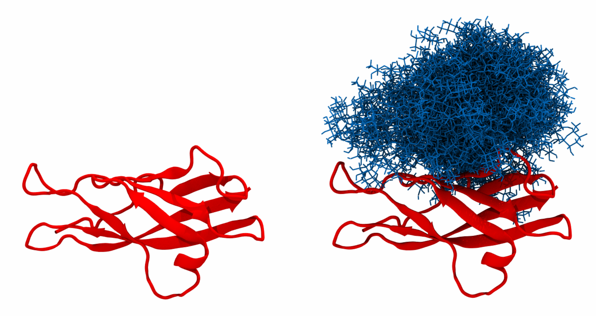
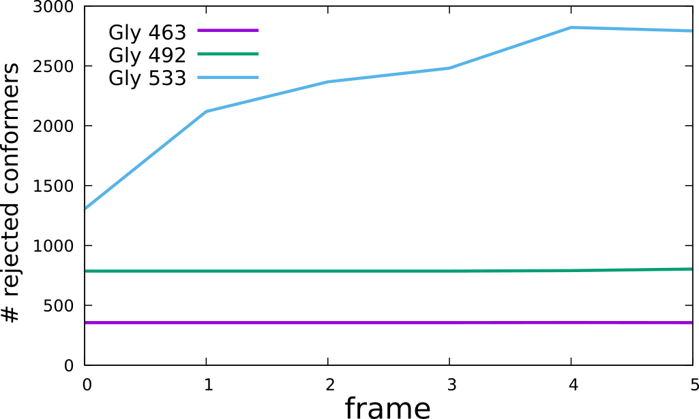
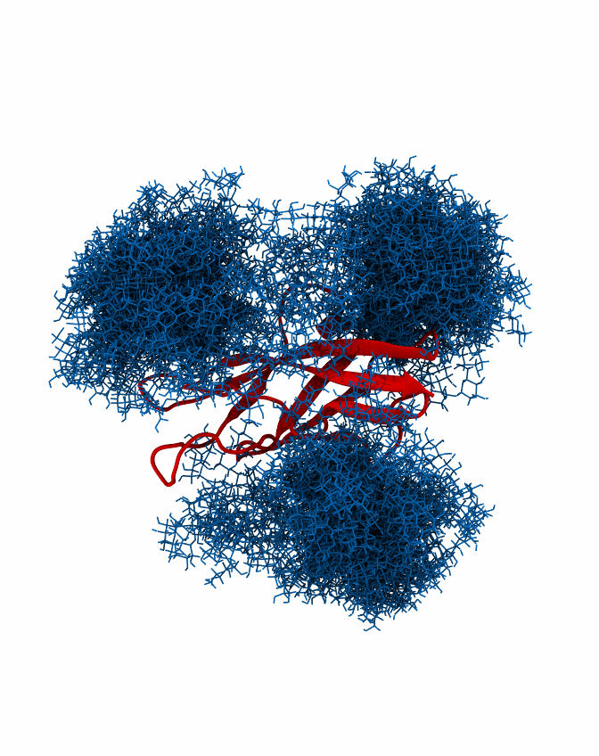
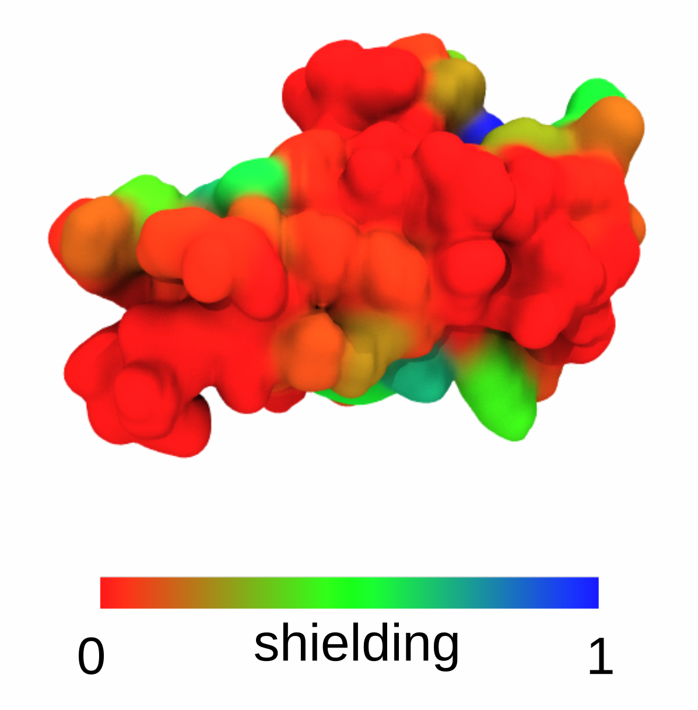

# GlycoSHIELD
A simple MD pipeline to generate realistic glycoprotein models

## GlycoSHIELD tutorial

The tutorial should be run from within the "TUTORIAL" folder to access all neccessary files.

Tutorial files include a N-cadherin EC5 domain (EC5.pdb), which natively contains three gly-
cosylation sites at positions 463, 492 and 533. In the tutorial, we will glycosylate the protein
with high-mannose N-glycans (Man5) and visualise the span and shielding of the resulting
sugar cover. The necessary glycan conformers are located in the GLYCAN_LIBRARY folder
and include Man5.pdb (reference file) and Man5_dt1000.xtc (conformer library sampled at
1000ps intervals). Folders containing different glycans have to be downloaded by users to a
local directory and unzipped prior to use.
The prepared input file (EC5_input) manages the glycan grafting:
```
A 462,463,464 1,2,3 GLYCAN_LIBRARY/Man5.pdb GLYCAN_LIBRARY/Man5_dt1000.xtc A_463.pdb A_463.xtc
A 491,492,493 1,2,3 GLYCAN_LIBRARY/Man5.pdb GLYCAN_LIBRARY/Man5_dt1000.xtc A_492.pdb A_492.xtc
```
To graft glycans at the selected positions, run:
```
python ../GlycoSHIELD-0.1.py --protpdb EC5.pdb --inputfile EC5_input --threshold 3.5 --mode CG --shuffle-sugar
```
The program prints out the number of protein conformer (unless protein XTC file was given, it
will always be 0) and a number of grafted glycan conformers for each of the three glycosyla-
tion sites:
```
0 2619 1172 2569
```
In addition, A_463.pdb,... and A_463.xtc,... files are created, each containing protein struc-
ture and a given number of glycan conformers, which can be readily visualised e.g. using
VMD:



If multiple conformations of the same protein are available, GlycoSHIELD can be used to
estimate the entropic cost of geometrically blocking certain glycan conformers in each protein
conformer. An artificial trajectory EC4_EC5.xtc with corresponding PDB file EC4_EC5.pdb
can be used to visualise this functionality. In each consecutive frame, the angle between the
two domains is decreased. To monitor the number of accepted conformations, the following
command should be issued:
```
python ../GlycoSHIELD-0.1.py --protpdb EC4_EC5.pdb --protxtc EC4_EC5.xtc --inputfile EC5_input --threshold 3.5 --mode CG --shuffle-sugar --ignorewarn --dryrun 
```
--ignorewarn ensures the grafting continues even if no conformers can be grafted, --dryrun
disables production of an output trajectory and instead only displays the number of accepted
frames.
```
0 2645 2214 1695 
1 2645 2214 881 
2 2645 2214 633 
3 2645 2214 519 
4 2644 2210 179 
5 2645 2197 208
```
Knowing the number of all available frames (3000), the number of rejected frames can be
then plotted:



This illustrates that excessive bending of the inter-domain linker results in a rejection of the
majority of the conformers and would be thus associated with significant entropic penalty.
In order to generate a single trajectory with all glycans mobile, the number of glycan con-
formers has to be adjusted to be the same across all glycosylation sites, here 1172 is the
largest number of conformers present on all sites. This can be done using the script “Glyco-
TRAJ.py”:
```
python ../GlycoTRAJ-0.1.py --maxframe 1172 --outname <merged trajectory> --pdblist A_463.pdb,A_492.pdb,A_533.pdb --xtclist A_463.xtc,A_492.xtc,A_533.xtc --chainlist A,A,A --reslist 463,492,533
```
where `--maxframe` takes the desired number of glycan conformers and `--outname` takes the desired root
name of the output (the ending ''.xtc'' is appended automatically).



Trajectories containing multiple conformations of single glycans can be used to calculate the
shielding score using “GlycoSASA.py”. Using the example above, the syntax should be:
```
python ../GlycoSASA-0.1.py --pdblist A_463.pdb,A_492.pdb,A_533.pdb --xtclist A_463.xtc,A_492.xtc,A_533.xtc --probelist 0.14,0.25 --endframe 1172 --plottrace
```
This will use 1172 conformers of each glycan to calculate the shielding score. As an output,
the user obtains a plot of shielding score along the protein sequence:


In addition, a PDB file is created named “maxResidueSASA_probe_0.14.pdb”, where shield-
ing has been encoded in the column holding the beta factor information. Here, 0.14 denotes
the probe radius used for SASA calculation. An occupancy value of 1 marks residues acces-
sible in the absence of the glycans, and 0 if a given site is not accessible at all. Such PDB file
can be then displayed e.g. in VMD:


