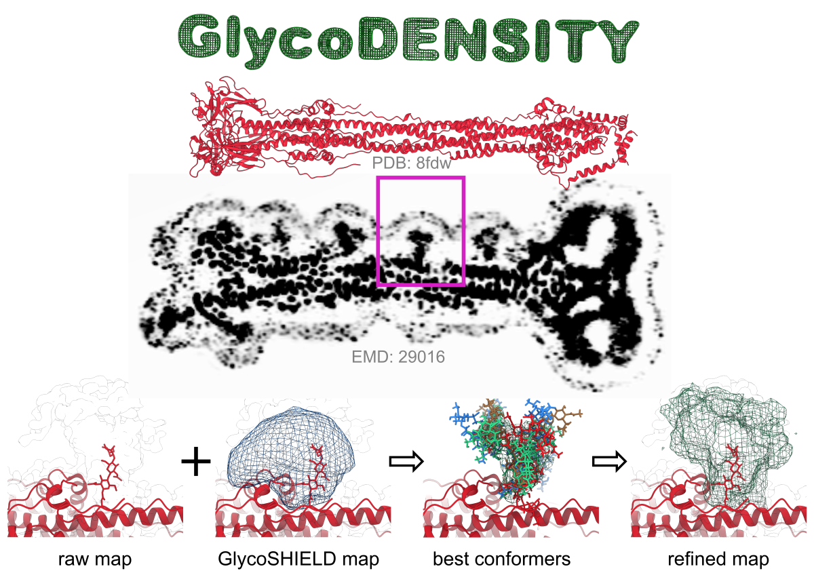

## Welcome to GlycoDENSITY

GlycoDENSITY is an open-source program that refines GlycoSHIELD predictions using experimental (volumetric) data, such as
cryoEM, cryoET maps, or X-ray electron density maps. GlycoDENSITY sorts glycan conformers grafted with GlycoSHIELD according to
their fit to the underlying experimental data.

## Download GlycoDENSITY

GlycoDENSITY is released under a specific license and is available for
[download here](https://dioscuri-biophysics.pages.mpcdf.de/glycodensity/){:target="_blank"}.
By downloading the code you acknowledge having read and accepted the terms of the license.

## Use case

<em>GlycoSHIELD ensemble refinement. Here we used SARS-CoV-2 Spike protein in its post-fusion state (red). Associated map contains
low resolution information about glycans (e.g. marked in magenta box), which is only allowing to trace first monosaccharides of
a glycan (first image in the bottom row, density is shown as outline, glycan as sticks). The remaining low resolution density
can be used to refine GlycoSHIELD ensemble. Glycans are first grafted with GlycoSHIELD and a synthetic density map is generated
to visualise span of the glycan mushroom. Next, GlycoDENSITY is used to select a small number of best-fit conformers (green,
blue, brown, red). Finally, we can generate a synthetic density map based on these conformers and see how well it represents the
experimental density.</em>

