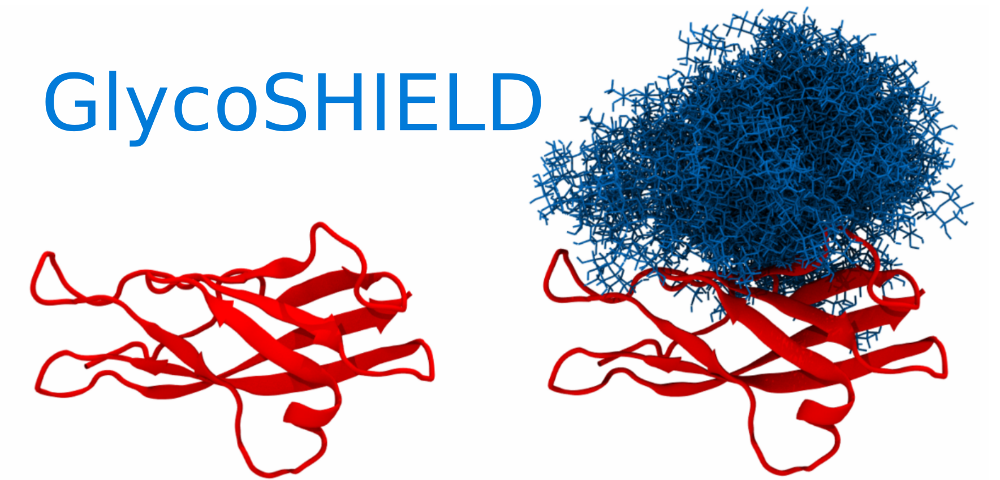

---
# Feel free to add content and custom Front Matter to this file.
# To modify the layout, see https://jekyllrb.com/docs/themes/#overriding-theme-defaults

layout: home
---

# Welcome to GlycoSHIELD!

Use GlycoSHIELD to graft glycan conformers on protein structures.
To launch the web application, please click
[here](https://notebooks.mpcdf.mpg.de/binder/v2/git/https%3A%2F%2Fgitlab.mpcdf.mpg.de%2FMPIBP-Hummer%2Fglycoshield-md.git/webapp_online?urlpath=streamlit)
or on the image below.

Please note that the interactive Cloud session that runs the web
application is completely ephemeral, and all files will be deleted
after its termination. If necessary, download a Zip archive with your
session data which is offered by the web GUI.
